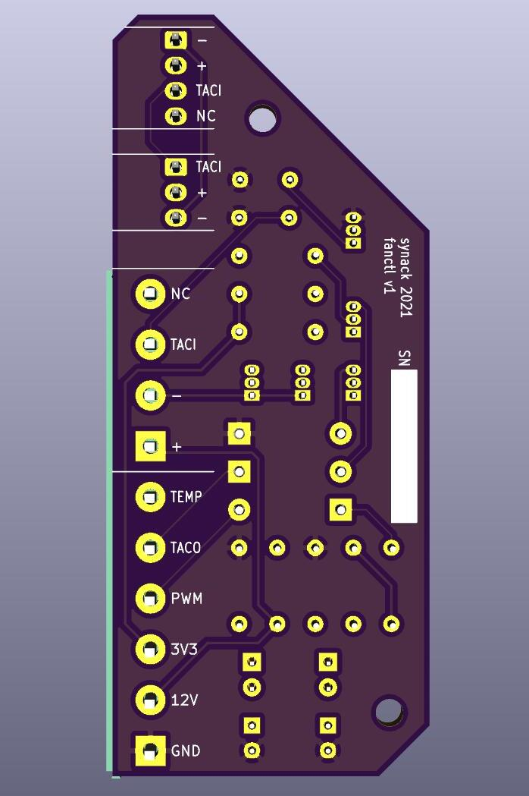

This project was meant to demonstrate closed loop PID control of a 3-pin PC
fan. While the resulting board works, I learned that the tachometer pin on the
fan is connected to a hall effect sensor, powered by +12V. This means that you
cannot sense and control the fan's speed at the same time. I came to the
conclusion that you should spend a few more dollars on a 4-pin fan that has an
onboard MOSFET and a separate signal for PWM.

I'm providing the the code and board files here as they may still be
interesting or useful as a reference or teaching tool.
